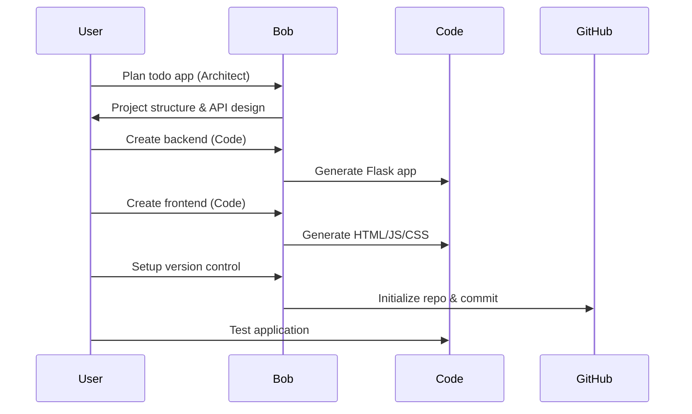
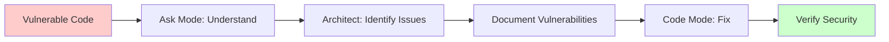

# Bob Bootcamp Labs - Visual Overview

## Lab Journey Map

## Lab 1: Building with Bob

### What You'll Build
A full-stack Todo application with Python Flask backend and JavaScript frontend

### Bob Features Showcased
- 🎯 **Plan Mode**: Plan project structure and API design
- 💻 **Code Mode**: Implement backend and frontend
- ❓ **Ask Mode**: Get explanations and guidance
- ⚡ **Auto-approvals**: Rapid development workflow
- 📝 **Literate Coding**: Self-documenting code
- 🔗 **GitHub MCP**: Version control integration

### Technology Stack
```
Frontend:          Backend:           Tools:
- HTML5            - Python 3.8+      - Bob AI
- CSS3             - Flask            - Git/GitHub
- JavaScript       - SQLite           - MCP Servers
```

### Learning Flow


### Key Outcomes
✅ Functional todo application  
✅ Understanding of Bob modes  
✅ Experience with auto-approvals  
✅ GitHub integration knowledge  
✅ Full-stack development skills  

---

## Lab 2: Security & Analysis

### What You'll Analyze
A vulnerable todo application with intentional security flaws

### Bob Features Showcased
- ❓ **Ask Mode**: Understand existing code
- 🎯 **Plan Mode**: Plan security fixes
- 💻 **Code Mode**: Implement fixes
- 🔍 **Code Analysis**: Multi-file understanding
- 🛡️ **Security Awareness**: Vulnerability detection

### Vulnerabilities Included
```
1. SQL Injection
   Location: Backend database queries
   Risk: High
   
2. Cross-Site Scripting (XSS)
   Location: Frontend DOM manipulation
   Risk: High
   
3. Hardcoded Secrets
   Location: Configuration files
   Risk: Critical
   
4. Missing Input Validation
   Location: API endpoints
   Risk: Medium
```

### Analysis Flow


### Security Fixes Applied
| Vulnerability | Fix Applied |
|--------------|-------------|
| SQL Injection | Parameterized queries |
| XSS | Input sanitization & textContent |
| Hardcoded Secrets | Environment variables |
| Input Validation | Schema validation |

### Key Outcomes
✅ Security vulnerability identification  
✅ Understanding of common attacks  
✅ Secure coding practices  
✅ Code analysis skills  
✅ Fix implementation experience  

---
